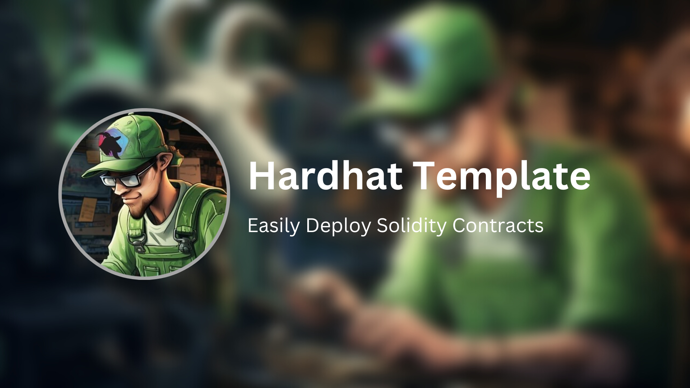

# hardhat-template

Smart Contract Development Kit Template, using HardHat

## Introduction


## Installation

Run the standard installation command:

```bash
npm install
```

## Usage

## Support

Currently, this project supports the following chains:

 - Ethereum Mainnet
 - Optimism Mainnet
 - Cronos Mainnet
 - Ethereum Classic Mainnet
 - xDai Chain (Gnosis)
 - Matic Mainnet
 - Manta Pacific Mainnet
 - Fantom Mainnet
 - PulseChain Mainnet
 - KAVA Mainnet
 - Base Chain Mainnet
 - Arbitrum Mainnet
 - Avalanche Mainnet

## Contributing


## License


## Credits